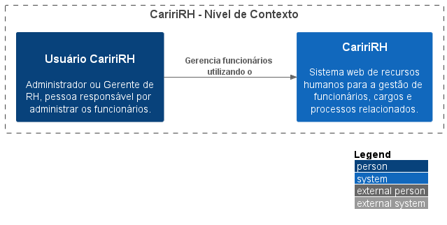

# 🏢 Documentação C4 Model - Sistema Cariri RH

  

## 📋 Sobre o Projeto

O **Sistema Cariri RH** é uma aplicação web de recursos humanos desenvolvida para a gestão eficiente de funcionários, cargos e processos relacionados. Esta documentação utiliza o **Modelo C4** para visualizar a arquitetura do sistema em diferentes níveis de abstração.

## 🏗️ Modelo C4

O Modelo C4 é uma abordagem para visualização de arquitetura de software que utiliza quatro níveis de diagramas:

1. **Contexto (Nível 1)**: Visão geral do sistema
2. **Contêineres (Nível 2)**: Componentes de alto nível do sistema
3. **Componentes (Nível 3)**: Detalhamento dos contêineres
4. **Código (Nível 4)**: Implementação detalhada

## 📚 Estrutura da Documentação

### [Nível 1 | Contexto | Visão Geral](/docs/nivel1-context.md)
- Escopo: O sistema CaririRH como um todo
- Elementos principais: Sistema CaririRH e seus usuários
- Público-alvo: Todos, tanto pessoas técnicas quanto não técnicas

### [Nível 2 | Contêineres | Sistema Cariri RH](/docs/Sistema%20Cariri%20RH/nivel2-conteiner.md)
- Escopo: Arquitetura interna do sistema
- Elementos principais: Contêineres dentro do sistema (aplicações, bancos de dados)
- Público-alvo: Pessoas técnicas (arquitetos, desenvolvedores, operações)

### [Nível 3 | Componentes | API Application](/docs/Sistema%20Cariri%20RH/Aplicacao%20de%20API/nivel3-componentes.md)
- Escopo: Detalhamento da API do sistema
- Elementos principais: Componentes internos da API
- Público-alvo: Desenvolvedores e arquitetos de software

### [Nível 4 | Códigos | Services e Controllers](/docs/Sistema%20Cariri%20RH/Aplicacao%20de%20API/Diagrama%20de%20Classes/nivel4-codes.md)
- Escopo: Implementação detalhada
- Elementos principais: Classes, interfaces e relacionamentos
- Público-alvo: Desenvolvedores

## 🛠️ Tecnologias

O Sistema Cariri RH é desenvolvido utilizando tecnologias modernas para garantir eficiência, segurança e escalabilidade.

## 👥 Usuários

- **Administradores**: Acesso completo ao sistema
- **Gerentes de RH**: Gerenciamento de funcionários e processos

## 📝 Como Utilizar Esta Documentação

1. Comece pelo [Nível 1](/docs/nivel1-context.md) para entender o contexto geral
2. Avance para os níveis mais detalhados conforme necessário
3. Utilize os diagramas para compreender a arquitetura e as interações do sistema

## 🔄 Manutenção da Documentação

Esta documentação é mantida utilizando diagramas PlantUML (.puml) que são convertidos em imagens (.png) e documentados em arquivos Markdown (.md).

---

  
Sistema Cariri RH - Documentação de Arquitetura C4 Model

