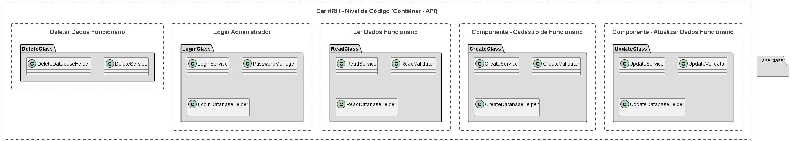

# Acesso rápido

* [**Nível 1 | Contexto | Visão Geral**](/docs/nivel1-context.md)
* [**Nível 2 | Contêineres | Sistema Cariri RH**](/docs/Sistema%20Cariri%20RH/nivel2-conteiner.md)
* [**Nível 3 | Componentes | API Application**](/docs/Sistema%20Cariri%20RH/Aplicacao%20de%20API/nivel3-componentes.md)
---

# Nível 4 | Códigos | Services e Controllers

## Visão Geral

O diagrama de código (nível 4) detalha a implementação dos componentes da API, mostrando as classes, serviços e helpers que compõem cada funcionalidade. Este nível fornece uma visão detalhada da estrutura de código do sistema.

## Escopo e Elementos

**Escopo**: Implementação detalhada dos componentes da API.

**Elementos principais**: 
- Classes e serviços
- Helpers de banco de dados
- Validadores
- Relacionamentos entre classes

**Público-alvo**: Desenvolvedores e programadores.

## Estrutura de Classes

O sistema está organizado em cinco componentes principais, cada um com sua própria estrutura de classes:

### 1. Componente - Deletar Dados Funcionário
- **DeleteClass**: Classe principal para exclusão de dados
- **DeleteService**: Serviço que implementa a lógica de negócios para exclusão
- **DeleteDatabaseHelper**: Helper para operações de banco de dados relacionadas à exclusão

### 2. Componente - Login Administrador
- **LoginClass**: Classe principal para autenticação
- **LoginService**: Serviço que implementa a lógica de login
- **PasswordManager**: Gerenciador de senhas e criptografia
- **LoginDatabaseHelper**: Helper para operações de banco de dados relacionadas à autenticação

### 3. Componente - Ler Dados Funcionário
- **ReadClass**: Classe principal para leitura de dados
- **ReadService**: Serviço que implementa a lógica de consulta
- **ReadValidator**: Validador de parâmetros de consulta
- **ReadDatabaseHelper**: Helper para operações de banco de dados relacionadas à leitura

### 4. Componente - Cadastro de Funcionário
- **CreateClass**: Classe principal para cadastro
- **CreateService**: Serviço que implementa a lógica de criação
- **CreateValidator**: Validador de dados de entrada
- **CreateDatabaseHelper**: Helper para operações de banco de dados relacionadas ao cadastro

### 5. Componente - Atualizar Dados Funcionário
- **UpdateClass**: Classe principal para atualização
- **UpdateService**: Serviço que implementa a lógica de atualização
- **UpdateValidator**: Validador de dados de atualização
- **UpdateDatabaseHelper**: Helper para operações de banco de dados relacionadas à atualização

## Padrões de Design

O sistema utiliza o padrão MVC (Model-View-Controller) adaptado para uma API REST, com:
- **Controllers**: Classes principais que recebem as requisições
- **Services**: Implementam a lógica de negócios
- **Validators**: Validam os dados de entrada
- **DatabaseHelpers**: Abstraem o acesso ao banco de dados

## Diagrama de Classes

