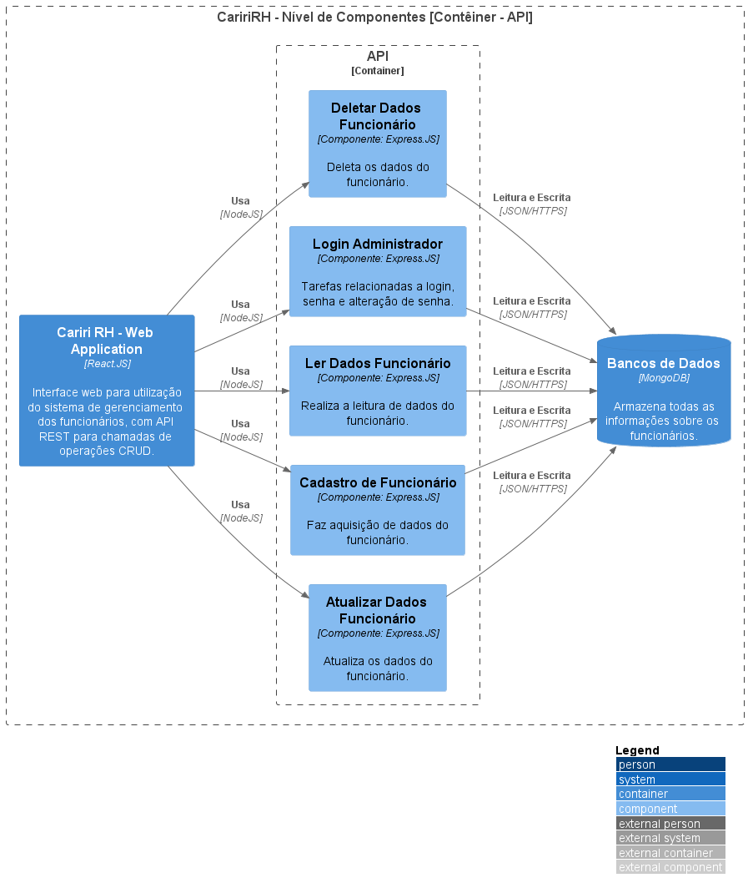

# Acesso rápido

* [**Nível 1 | Contexto | Visão Geral**](/docs/nivel1-context.md)
* [**Nível 2 | Contêineres | Sistema Cariri RH**](/docs/Sistema%20Cariri%20RH/nivel2-conteiner.md)
* [**Nível 3 | Componentes | API Application**](/docs/Sistema%20Cariri%20RH/Aplicacao%20de%20API/nivel3-componentes.md)
* [**Nível 4 | Códigos | Services e Controllers**](/docs/Sistema%20Cariri%20RH/Aplicacao%20de%20API/Diagrama%20de%20Classes/nivel4-codes.md)
---

# Nível 3 | Componentes | API Application

## Descrição

O diagrama de componentes detalha a estrutura interna da API do Sistema Cariri RH, mostrando como ela é composta por diversos componentes, suas responsabilidades e detalhes de implementação.

## Propósito

Este nível de documentação permite visualizar:
- A arquitetura interna da API
- As responsabilidades de cada componente
- As interações entre os componentes
- As tecnologias utilizadas em cada componente

## Elementos Principais

- **Controllers**: Gerenciam as requisições HTTP e direcionam para os serviços apropriados
- **Services**: Contêm a lógica de negócio do sistema
- **Repositories**: Responsáveis pela comunicação com o banco de dados
- **Models**: Representam as entidades do sistema

## Tecnologias

- **Backend**: Node com Express
- **Padrões**: MVC com Dependency Injection
- **Comunicação**: REST API

## Diagrama de Componentes

## Interações Principais

1. Os Controllers recebem requisições HTTP dos clientes
2. Os Controllers delegam o processamento para os Services apropriados
3. Os Services implementam a lógica de negócio e utilizam os Repositories
4. Os Repositories acessam o banco de dados utilizando os Models

## Considerações de Segurança

- Autenticação via JWT (JSON Web Tokens)
- Autorização baseada em roles
- Validação de entrada em todas as requisições

---

> Nota: Este diagrama representa a estrutura atual da API e pode ser atualizado conforme o desenvolvimento evolui.