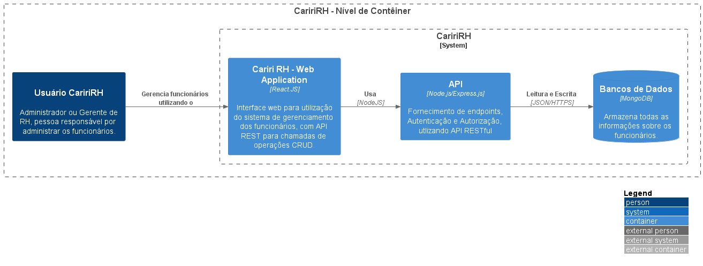

# Acesso rápido

* [**Nível 1 | Contexto | Visão Geral**](/docs/nivel1-context.md)
* [**Nível 3 | Componentes | API Application**](/docs/Sistema%20Cariri%20RH/Aplicacao%20de%20API/nivel3-componentes.md)
* [**Nível 4 | Códigos | Services e Controllers**](/docs/Sistema%20Cariri%20RH/Aplicacao%20de%20API/Diagrama%20de%20Classes/nivel4-codes.md)
---

# Nível 2 | Contêineres | Sistema Cariri RH

Once you understand how your system fits in to the overall IT environment, a really useful next step is to zoom-in to the system boundary with a Container diagram. A "container" is something like a server-side web application, single-page application, desktop application, mobile app, database schema, file system, etc. Essentially, a container is a separately runnable/deployable unit (e.g. a separate process space) that executes code or stores data.

The Container diagram shows the high-level shape of the software architecture and how responsibilities are distributed across it. It also shows the major technology choices and how the containers communicate with one another. It's a simple, high-level technology focussed diagram that is useful for software developers and support/operations staff alike.

**Scope**: A single software system.

**Primary elements**: Containers within the software system in scope.
Supporting elements: People and software systems directly connected to the containers.

**Intended audience**: Technical people inside and outside of the software development team; including software architects, developers and operations/support staff.

**Notes**: This diagram says nothing about deployment scenarios, clustering, replication, failover, etc.

---

